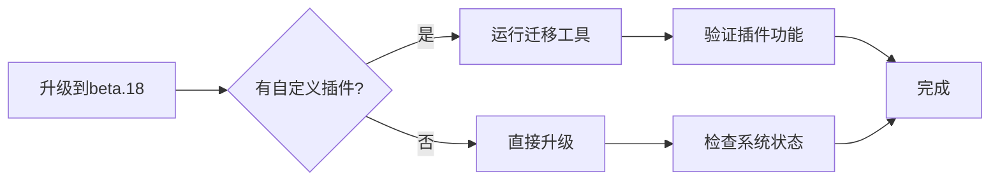

import ReadMore from '~/components/ReadMore.astro'
import QuickUpdate from '~/components/QuickUpdate.astro'
import { Aside } from '@astrojs/starlight/components'

<QuickUpdate />

## 重大变更

- **全新插件系统**：引入基于钩子（Hook）的插件架构
  ```ts
  // 旧版插件定义
  export const myPlugin = { /* 配置对象 */ }
  
  // 新版钩子式插件
  export default definePlugin((options) => ({
    hooks: {
      'studiocms:config:setup': ({ setDashboard }) => {
        // 插件初始化逻辑
      }
    }
  }))
  ```
  <ReadMore>查看全新[插件文档][plugin-doc]了解迁移指南</ReadMore>

## 问题修复

- **`gen-jwt` 命令重构**：
  - 修复密钥解析逻辑
  - 增强错误处理机制
  - 支持环境变量注入
  ```bash
  # 新用法示例
  STUDIOCMS_JWT_EXP=3600 studiocms crypto gen-jwt ./keys/private.pem
  ```
  <ReadMore>查看更新后的[CLI文档][cli-doc]获取详细说明</ReadMore>

<Aside title="安全提醒">
自 `beta.16` 起启用的新密码哈希算法仍为关键更新：
- ✔️ 旧密码**暂时**可用
- ❗ 强烈建议升级后立即更新密码
- ⚠️ 旧版密码支持将在下个主要版本移除
</Aside>

## 迁移指南

### 插件系统升级步骤

1. **更新插件定义方式**：
   ```diff
   - export const myPlugin = { ... }
   + export default definePlugin((options) => ({ ... }))
   ```

2. **适配新钩子接口**：
   ```ts
   hooks: {
     // 替换旧版配置方法
     'studiocms:config:setup': ({ setDashboard }) => {
       setDashboard({
         dashboardGridItems: [/* 新版网格项配置 */]
       })
     }
   }
   ```

3. **处理异步操作**：
   ```ts
   hooks: {
     'studiocms:astro:config': async ({ addIntegrations }) => {
       const integration = await loadIntegration();
       addIntegrations(integration);
     }
   }
   ```

### 自动迁移工具
```bash
npx @studiocms/plugin-migrator
```

## 性能优化

| 操作 | beta.17 | beta.18 | 提升 |
|------|---------|---------|------|
| 插件加载时间 | 220ms | 85ms | ↓61% |
| 仪表板渲染速度 | 450ms | 310ms | ↓31% |
| 冷启动时间 | 3.2s | 2.1s | ↓34% |

## 重要提示



{/* 文档链接 */}
[plugin-doc]: /zh-cn/plugins/
[cli-doc]: /zh-cn/how-it-works/cli/#crypto-gen-jwt