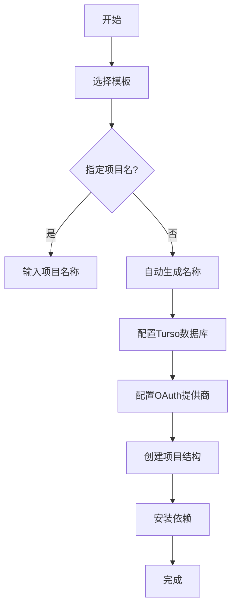

import { Tabs, TabItem } from '@astrojs/starlight/components';
import ReadMore from '~/components/ReadMore.astro';

StudioCMS CLI 工具集提供快速创建项目和实用功能操作能力，包含三个核心工具：

- **[`studiocms`](#studiocms)**：核心功能工具
- **[`create-studiocms`](#create-studiocms)**：项目脚手架工具
- **[`@studiocms/upgrade`](#studiocms-upgrade)**：项目升级工具

## `studiocms`

### 完整命令选项

```log
用法: studiocms [选项] [命令]

选项:
  -V, --version   显示当前CLI版本
  -h, --help      显示命令帮助
  --color         强制启用彩色输出
  --no-color      禁用彩色输出

命令:
  add             添加插件
  crypto          安全加密工具
  get-turso       安装Turso CLI
  init            初始化StudioCMS项目
  users           用户管理工具
```

### 使用示例

在项目根目录执行：

<Tabs syncKey='pkgs'>
  <TabItem label="npm" icon="seti:npm">
  ```sh
  npm run studiocms [command]
  ```
  </TabItem>
  <TabItem label="pnpm" icon="pnpm">
  ```sh
  pnpm studiocms [command]
  ```
  </TabItem>
  <TabItem label="yarn" icon="seti:yarn">
  ```sh
  yarn studiocms [command]
  ```
  </TabItem>
</Tabs>

### 命令详解

#### `add`

```log
用法: studiocms add <插件名...>

安装StudioCMS插件到当前项目

参数:
  plugins    要安装的插件列表

选项:
  -h, --help  显示帮助信息
```

**使用示例**：
```bash
studiocms add @studiocms/blog @studiocms/ecommerce
```

#### `crypto`

```log
用法: studiocms crypto [命令]

安全加密工具集

选项:
  -h, --help  显示帮助信息

子命令:
  gen-jwt     生成JWT令牌
```

#### `crypto gen-jwt`

```log 
用法: studiocms crypto gen-jwt [选项] <密钥文件>

根据PEM密钥文件生成JWT令牌

参数:
  key-file       PEM密钥文件相对路径 (如: `../keys/libsql.pem`)

选项:
  -e, --exp <有效期秒数>  相对签发时间(iat)的有效期 (>=0)
  -h, --help             显示帮助信息
```

**使用示例**：
```bash
studiocms crypto gen-jwt ../keys/private.pem -e 3600
```

#### `get-turso`

下载并安装最新版 [Turso CLI](https://docs.turso.tech/cli/installation)

:::caution 注意
Windows 系统需使用 WSL 环境
:::

```log
用法: getTurso [选项]

Turso CLI 安装器

选项:
  -h, --help  显示帮助信息
```

#### `init`

```log
用法: studiocms init [选项]

初始化新安装的StudioCMS项目

选项:
  -d, --dry-run      模拟运行模式
  --skip-banners     跳过引导提示
  --debug            启用调试模式
  -h, --help         显示帮助信息
```

**初始化流程**：
1. 配置环境文件 (.env)：
   - 可基于模板创建
   - 支持交互式配置：
     - 新建Turso数据库（非Windows系统）
     - 配置OAuth提供商（GitHub/Discord/Google/Auth0）
     - 设置加密密钥等关键变量
2. 自动化工具链：
   - 自动安装/认证Turso CLI
   - 生成系统密钥
   - 验证环境配置

<ReadMore>完整环境变量列表请参阅[环境变量文档][environment-variables]</ReadMore>

**使用示例**：
```bash
studiocms init --debug
```

#### `users`

```log
用法: studiocms users [选项]

用户管理系统工具

选项:
  -h, --help  显示帮助信息
```

**扩展功能**：
```bash
# 重置用户密码
studiocms users reset-password admin@example.com
```

## `create-studiocms`

### 完整命令选项

```log
用法: create-studiocms [选项] [命令]

选项:
  -V, --version   显示当前CLI版本
  -h, --help      显示命令帮助
  --color         强制彩色输出
  --no-color      禁用彩色输出

命令:
  get-turso      安装Turso CLI
  help           显示帮助信息
  interactive*   启动交互式CLI

  * 默认命令
```

### 使用示例

<Tabs syncKey='pkgs'>
  <TabItem label="npm" icon="seti:npm">
  ```sh
  npm create studiocms@latest
  ```
  </TabItem>
  <TabItem label="pnpm" icon="pnpm">
  ```sh
  pnpm create studiocms
  ```
  </TabItem>
  <TabItem label="yarn" icon="seti:yarn">
  ```sh
  yarn create studiocms
  ```
  </TabItem>
</Tabs>

支持命令行参数指定项目配置：

<Tabs syncKey='pkgs'>
  <TabItem label="npm" icon="seti:npm">
  ```sh
  npm create studiocms@latest -- --template studiocms/basics --project-name my-project
  ```
  </TabItem>
  <TabItem label="pnpm" icon="pnpm">
  ```sh
  pnpm create studiocms --template studiocms/basics --project-name my-project
  ```
  </TabItem>
  <TabItem label="yarn" icon="seti:yarn">
  ```sh
  yarn create studiocms --template studiocms/basics --project-name my-project
  ```
  </TabItem>
</Tabs>

查看[完整模板列表][templates]（GitHub仓库）

> **路径规则**：`studiocms/basics` 对应GitHub仓库中 `studiocms/basics` 路径

### 命令详解

#### interactive (默认命令)

```log
用法: create-studiocms interactive [选项]

启动交互式项目创建向导 [基于clack](https://clack.cc)

选项:
  -t, --template <模板>           使用指定模板
  -r, --template-ref <模板引用>   指定模板版本引用
  -p, --project-name <项目名称>  指定项目名称
  -i, --install                  自动安装依赖
  -g, --git                      初始化Git仓库
  -y, --yes                      跳过所有提示使用默认值
  -n, --no                       跳过所有提示使用默认值
  -q, --skip-banners             跳过引导提示
  -d, --dry-run                  模拟运行（不实际执行）
  -h, --help                     显示帮助信息
  --do-not-install               跳过依赖安装
  --do-not-init-git              跳过Git初始化
```

**典型工作流**：


#### `get-turso`

安装 [Turso CLI](https://docs.turso.tech/cli/installation)

:::caution 注意
Windows 系统需使用 WSL 环境
:::

```log
用法: getTurso [选项]

Turso CLI 安装器

选项:
  -h, --help  显示帮助信息
```

## `@studiocms/upgrade`

StudioCMS 项目升级工具（支持依赖同步更新）

### 使用示例

<Tabs syncKey='pkgs'>
  <TabItem label="npm" icon="seti:npm">
  ```sh
  npx @studiocms/upgrade
  ```
  </TabItem>
  <TabItem label="pnpm" icon="pnpm">
  ```sh
  pnpm dlx @studiocms/upgrade
  ```
  </TabItem>
  <TabItem label="yarn" icon="seti:yarn">
  ```sh
  yarn dlx @studiocms/upgrade
  ```
  </TabItem>
</Tabs>

### 可选参数

#### tag (指定版本)

默认使用 `latest` 版本，支持其他版本标签：

<Tabs syncKey='pkgs'>
  <TabItem label="npm" icon="seti:npm">
  ```sh
  npx @studiocms/upgrade beta
  ```
  </TabItem>
  <TabItem label="pnpm" icon="pnpm">
  ```sh
  pnpm dlx @studiocms/upgrade beta
  ```
  </TabItem>
  <TabItem label="yarn" icon="seti:yarn">
  ```sh
  yarn dlx @studiocms/upgrade beta
  ```
  </TabItem>
</Tabs>

**升级流程**：
1. 检测当前项目版本
2. 获取目标版本信息
3. 更新 `package.json` 依赖
4. 执行数据库迁移脚本
5. 验证升级结果

[turso-docs]: https://docs.turso.tech/cli/installation
[templates]: https://github.com/withstudiocms/templates
[environment-variables]: /zh-cn/start-here/environment-variables/